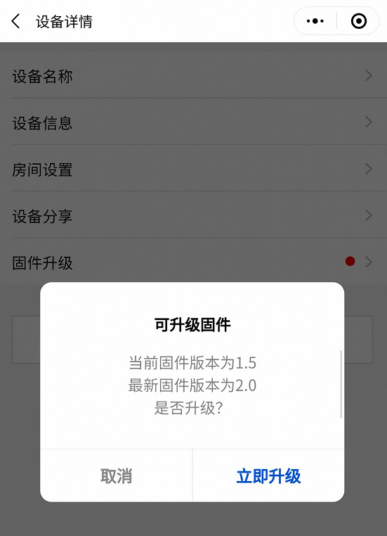

# Smart Light 

## 介绍
`Smart Light` 使用  [ESP32-S2-Saola-1开发板](https://docs.espressif.com/projects/esp-idf/zh_CN/latest/esp32s2/hw-reference/esp32s2/user-guide-saola-1-v1.2.html) 上带有的 `ws2812 RGB模块` 配合 `腾讯连连小程序` 演示一个智能灯控制方案。

实现的功能：
- 通过腾讯连连小程序配网
- 通过腾讯连连小程序完成控制
- 支持OTA升级功能

## 详细说明
### 0.参考 [README](../../../README.md) 文档进行硬件准备、IDF环境搭建、腾讯云 SDK 准备

### 1.在腾讯云物联网开发平台进行相关配置

- 新建项目
> 此处可随意填写

- 新建产品
<div  align="center">  
 
</div>

&nbsp;

- 数据模板
>标识符一定要正确

1. 通过`标准功能-添加功能` 添加标准属性
<div  align="center">  
 
</div>

2. 通过`自定义功能-其他功能` 添加额外的属性
<div  align="center">  
 
</div>

&nbsp;

- 设备开发

    此处可不进行选择

&nbsp;

- 交互开发

    选择`softap`
> 如切换不成功，需要在`自定义配置`中调整顺序
<div  align="center">  
 
</div>

&nbsp;

- 设备调试

    此处可以查看设备的各种信息，可以直接下发指令
<div  align="center">  
 
</div>

&nbsp;

- 批量生产

    此处可以查看`配网二维码`。
>您也可以直接扫描下方二维码完成配网
<div  align="center">  
 
</div>


### 2.编译、下载工程
- 您需要参考 [README](../../../README.md) 文档的`6.编译&烧写&运行`完成三元组信息的填写
- 在`smart_light`目录下编译整个工程
```
idf.py fullclean 
idf.py build
```
- 下载工程，并打开监视器
```
idf.py flash monitor
```

### 3.配网
- 扫描二维码根据提示配网，此时`ws218`将进入呼吸灯模式

- 完成配网后会自动保存网络信息，下次启动时可自行连接，可以通过`idf.py erase_flash`擦除配网信息，也可通过`快速复位5次`擦除配网信息

### 4.控制
- 待小程序显示设备在线时，可以实现亮度、颜色、状态的控制
> 物联网平台的`在线调试`也可实现控制功能
<div  align="center">  
 
</div>

### 5.OTA升级
- 编译新固件

    首先您需要现更改当前固件的版本，他被定义为[#define APP_VERSION](/qcloud/examples/smart_light/components/samples/smart_light.c)，随后通过`idf.py build`完成编译，编译输出的文件在[build/smartlight.bin](/build/)

- 在物联网开发平台选择`固件升级`
<div  align="center">  
 
</div>

&nbsp;

- 上传新的固件 
>`固件版本` 需要与bin文件一致，`字符串形式`
<div  align="center">  
 
</div>

&nbsp;

- 升级固化
>升级固件有2种下发方式

1. 通过腾讯云物联网平台下发

<div  align="center">  

</div>

&nbsp;

2. 通过腾讯连连小程序下发
<div  align="center">  

</div>

&nbsp;
- 等待升级完成

    设备升级完成后，会自动完成重启功能，腾讯云控制与腾讯连连小程序都会显示`升级成功`
